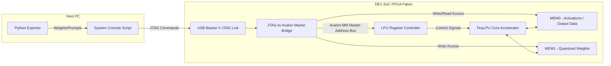

# DE1-SoC JTAG Inference Workflow: TinyLPU Accelerator

This guide provides a comprehensive, step-by-step workflow to synthesize, deploy, and run inference using your **TinyLPU** accelerator on the **Terasic DE1-SoC** (Cyclone V) board. 

By utilizing a **JTAG-to-Avalon Master Bridge**, you can communicate with your design, load weights/prompt activations, trigger inference, and retrieve output logits directly from your host PC over the USB-Blaster II interface—**entirely bypassing the need for an SD card or booting Linux on the ARM cores**.

---

## Architectural Setup

The host PC maps memory writes and reads over JTAG, which the bridge translates into standard Avalon-Memory Map (Avalon-MM) transactions on the FPGA fabric:



---

## Phase 1: Platform Designer (Qsys) Integration

Intel Platform Designer is used to build the interconnect system mapping the JTAG Bridge to your TinyLPU hardware memory addresses.

1. Open **Quartus Prime Lite 18.1** and load your project.
2. Launch Platform Designer under **Tools > Platform Designer**.
3. Add the following IP cores:
   * **System Clock Source** (default `clk_in`).
   * **JTAG to Avalon Master Bridge** (under *Decoder/Interconnect/Bridges*).
   * **LPU Wrapper IP** (wrap your `lpu.sv` control signals and SRAM buses inside Avalon-MM Slaves).
4. Connect the ports of the **JTAG Bridge master** to the slave ports of your memory segments:
   * Connect `master.instruction_sender` / `avalon_master` to your **TinyLPU Address Space**.
5. Set the Address Map offsets:
   * **LPU Registers (Ctrl/Status):** `0x0000_0000` (Range: 64 bytes)
   * **MEM0 (Input/Output SRAM):** `0x0001_0000` (Range: 8KB/16KB depending on your packaging width)
   * **MEM1 (Weights SRAM):** `0x0002_0000` (Range: 8KB/16KB)
6. Connect the main system clock (`clk`) and reset (`reset_n`) from the `Clock Source` to all components.
7. Click **Generate HDL...** to generate SystemVerilog files for your system.

---

## Phase 2: HDL Top Wrapper & Pin Placement

You need to wire the Platform Designer system to the physical clock and reset inputs of the DE1-SoC board.

1. Create a top-level module named `de1_soc_top.sv` in your Quartus project:

```systemverilog
module de1_soc_top (
    input  logic        CLOCK_50,  // 50 MHz default system clock
    input  logic [0:0]  KEY,       // SW pushbuttons (KEY[0] = Reset)
    output logic [7:0]  LEDR       // Diagnostic LEDs
);

    // Platform Designer instantiation wrapper
    platform_designer_system u_qsys (
        .clk_clk       (CLOCK_50),
        .reset_reset_n (KEY[0])
    );

    // Optional debug mapping: tie LPU operational status lines to LED pins
    assign LEDR[0] = KEY[0]; // Power Indicator
    assign LEDR[7:1] = 7'b0;

endmodule
```

2. Open the **Pin Planner** (`Assignments > Pin Planner`) and configure your pins for the DE1-SoC:
   * `CLOCK_50` -> Pin **`PIN_AF14`** (50 MHz Clock)
   * `KEY[0]` -> Pin **`PIN_AJ4`** (Key 0 Button)
   * `LEDR[0]` -> Pin **`PIN_V16`** (LED 0)
3. Set the **MSEL[4:0]** switches on the back of the DE1-SoC board to JTAG configuration:
   * **`MSEL[4:0] = 10101`** (Switches 1, 3, 5 ON; 2, 4 OFF).
4. Run **Start Compilation** to synthesize your design and generate the standard `de1_soc_top.sof` bitstream.

---

## Phase 3: PyTorch Quantization & Weight Extraction

The FP32 float parameters stored inside `model/artifacts/tiny_lm_model.pt` must be converted into the quantized 8-bit formats required by the LPU's hardware execution units. Run this python script on your PC:

```python
import torch
import json
import numpy as np

# Load the trained PyTorch checkpoint
checkpoint = torch.load("model/artifacts/tiny_lm_model.pt", map_location="cpu")
state_dict = checkpoint["model_state_dict"]

# Helper functions to convert floats to signed 8-bit integer (INT8)
def quantize_to_int8(tensor):
    max_val = float(tensor.abs().max())
    if max_val == 0:
        return tensor.to(torch.int8).numpy().tolist(), 0
    
    # Calculate scaling shift offset scale
    scale = 127.0 / max_val
    quantized = tensor.mul(scale).round().clamp(-128, 127).to(torch.int8)
    return quantized.numpy().tolist(), scale

# We will export a JSON representation with quantized structures
quantized_weights = {}

for name, param in state_dict.items():
    if "weight" in name or "bias" in name:
        q_data, scale = quantize_to_int8(param)
        quantized_weights[name] = {
            "values": q_data,
            "scale": scale
        }

with open("quantized_weights_jtag.json", "w") as f:
    json.dump(quantized_weights, f, indent=2)

print("Quantization complete! Ready for hardware injection.")
```

---

## Phase 4: PC-to-Board Programming

1. Plug the **USB-Blaster II** cable from the DE1-SoC board to your PC.
2. In Quartus, open the **Programmer** (`Tools > Programmer`).
3. Click **Hardware Setup** and select the active USB-Blaster port.
4. Click **Auto Detect** to ensure the Programmer identifies the Cyclone V chain.
5. Path to `de1_soc_top.sof`, check the **Program/Configure** box next to the Cyclone V device, and hit **Start**.

---

## Phase 5: Executing Inference via System Console

With the FPGA configured, open **Tools > System Console** inside Quartus to run the Tcl script driving execution over the JTAG bridge:

```tcl
# =========================================================================
# LPU JTAG Inference Drive Script (system_console.tcl)
# =========================================================================

# 1. Establish JTAG Connection
set master_service [lindex [get_service_paths master] 0]
if {$master_service == ""} {
    error "Error: JTAG-to-Avalon bridge not found. Verify JTAG cable."
}
open_service master $master_service
puts "Connected to JTAG master: $master_service"

# Define System Addresses (Matching Platform Designer Addresses)
set ADDR_CTRL   0x00000000
set ADDR_MEM0   0x00010000
set ADDR_MEM1   0x00020000

# 2. Reset the LPU Core
# Write 1 to clear (bit 1 of control port)
master_write_32 $master_service $ADDR_CTRL 2 
after 5
master_write_32 $master_service $ADDR_CTRL 0

# 3. Load Quantized Model Weights and Inputs
# Example: Injecting INT8 quantized prompt activations to MEM0
# Assuming prompt tokens input vector "input_ids" = [35, 100, 259, 12]
set prompt_inputs [list 35 100 259 12 0 0 0 0] ;# Padding to 8-lane bounds
master_write_8 $master_service $ADDR_MEM0 $prompt_inputs

# Injecting INT8 weight matrices (e.g. Query Head Weights - transpose row majors)
set weight_data [list 12 -5 8 94 -2 0 110 -1]
master_write_8 $master_service $ADDR_MEM1 $weight_data

# 4. Trigger Hardware Execution
# Send start impulse (write 1 to control register bit 0)
master_write_32 $master_service $ADDR_CTRL 1
puts "LPU execution triggered. Polling status..."

# 5. Poll Status Register for Done Flag
set loops 0
set max_loops 100
set is_done 0

while {$loops < $max_loops} {
    # Read status register (32-bit width)
    set status [master_read_32 $master_service $ADDR_CTRL 1]
    # Check bit 0 (done flag)
    if {[expr {$status & 1}] != 0} {
        set is_done 1
        break
    }
    after 10
    incr loops
}

# 6. Retrieve Results and Decode
if {$is_done} {
    # Retrieve the Output logits array from MEM0 (e.g., read 8 lanes of INT8/FP32 logit predictions)
    set outputs [master_read_8 $master_service $ADDR_MEM0 8]
    puts "Hardware Inference Complete!"
    puts "Output Logits: $outputs"
} else {
    puts "Error: Hardware timed out before asserting done status flag."
}

# Close session
close_service master $master_service
```

Launch the script in System Console cmd:
```tcl
source system_console.tcl
```
